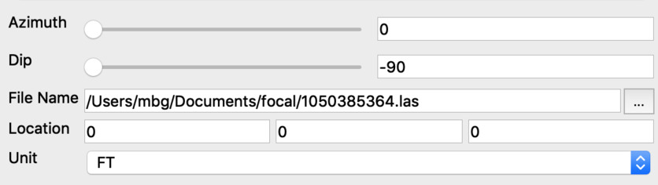
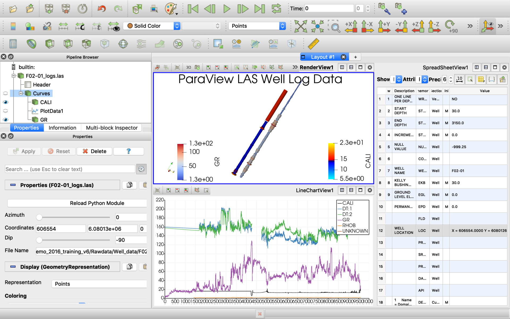

**N-Cube LAS Well Log Reader** - Read Well Log versions 1.2 and 2.0 of the LAS file specification.

This data reader allows to read LAS well log files versions 1.2 and 2.0 (not version 3 because we have no these files for now). 

Optional Collars Table attributes could be defined for the right 3D model:

  * Azimuth - anlge 0...360 degree (north direction)
  * Dip - anlge -90...90 degree (-90 is vertical down and 90 is vertical up direction)
  * Top Easting (X) Location - projected project coordinate, meters
  * Top Northing (Y) Location - projected project coordinate, meters
  * Top Elevation (Z) Location - projected project coordinate, meters

#### Defining of "unit" parameter (M, FT)

The unit parameter right definition is required for the right depth scale. It should be defined at the reader's "Header" table as first "Unit" in section "Curves" as meters (M, m) or feet (FT, ft). In case when it's defined incorrect you could fix it in the LAS file or append "Transform" ParaView filter to scale the reader's "Curves".

#### Definition of "azimuth"

This is the direction of a celestial object, measured clockwise around the observer's horizon from north. So an object due north has an azimuth of 0°, one due east 90°, south 180° and west 270°.

## Screenshots

