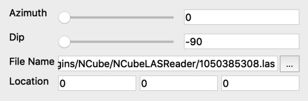

**N-Cube LAS Well Log Reader** - Read Well Log versions 1.2 and 2.0 of the LAS file specification.

This data reader allows to read LAS well log files versions 1.2 and 2.0 (not version 3 because we have no these files for now). 

Optional Collars Table attributes could be defined for the right 3D model:

  * Azimuth - anlge 0...360 degree (north direction)
  * Dip - anlge -90...90 degree (-90 is vertical down and 90 is vertical up direction)
  * Top Easting (X) Location - projected project coordinate, meters
  * Top Northing (Y) Location - projected project coordinate, meters
  * Top Elevation (Z) Location - projected project coordinate, meters

As units parameter for the right depth scale:

  * Unit - feet (FT) or meters (M). It should be defined in the reader's "Header" table but for now we define it manually.

#### Definition of "azimuth"

This is the direction of a celestial object, measured clockwise around the observer's horizon from north. So an object due north has an azimuth of 0°, one due east 90°, south 180° and west 270°.

## Screenshots

