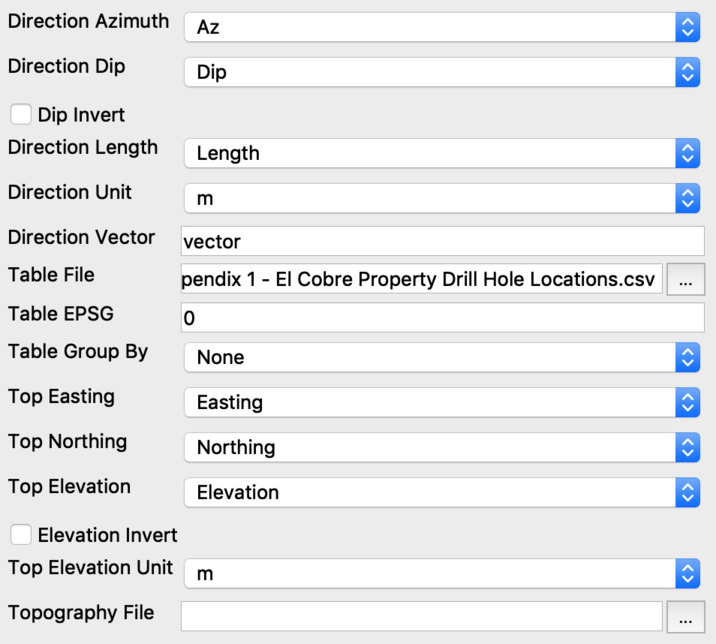
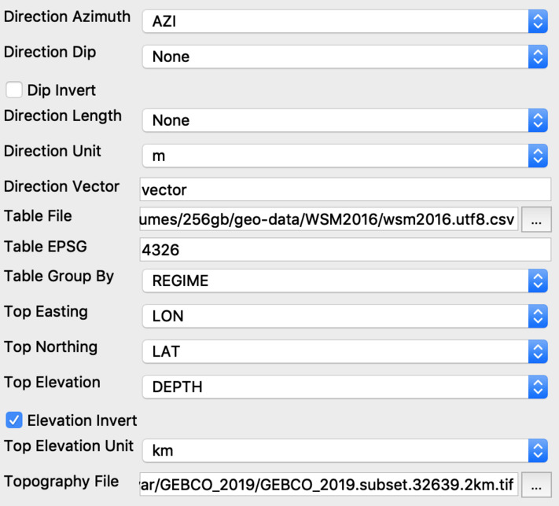

### N-Cube Table on Topography Block Source

#### How to load ElCobreMexico [Drill Hole Locations](https://github.com/mobigroup/ParaView-ElCobreMexico/blob/master/data/Appendix%201%20-%20El%20Cobre%20Property%20Drill%20Hole%20Locations.csv)


#### How to load [World Stress Map 2016](http://doi.org/10.5880/WSM.2016.001)

World Stress Map 2016 CSV file should be re-coded to Unicode with wrong characters ignored:

```
wget ftp://datapub.gfz-potsdam.de/download/10.5880.WSM.2016.001/wsm2016.csv
iconv -t utf8//IGNORE wsm2016.csv > wsm2016.utf8.csv 
```


