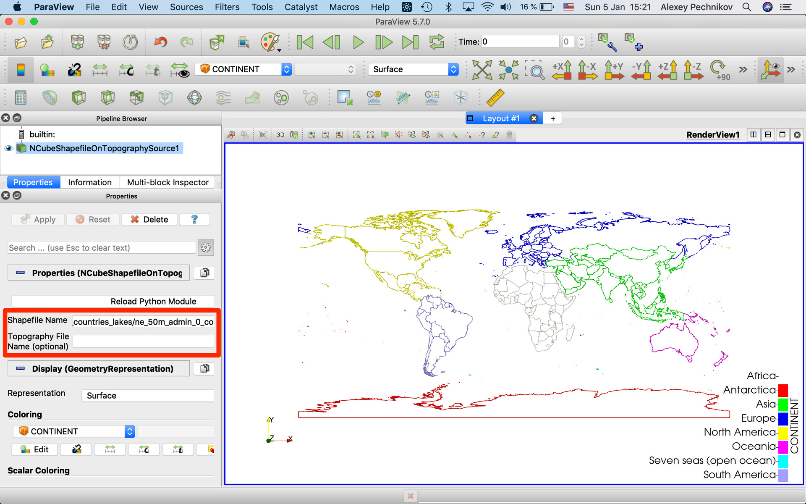
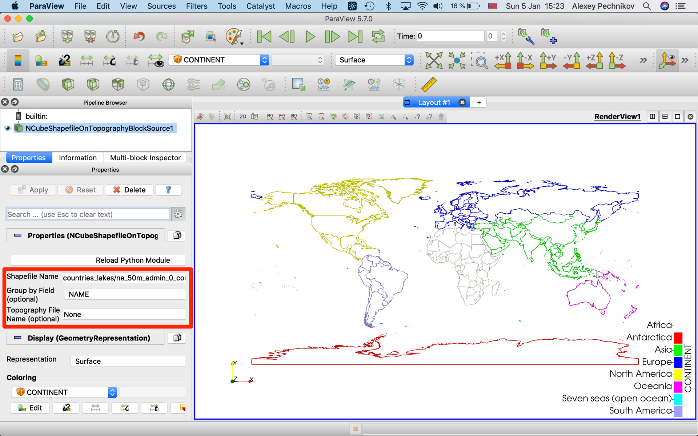
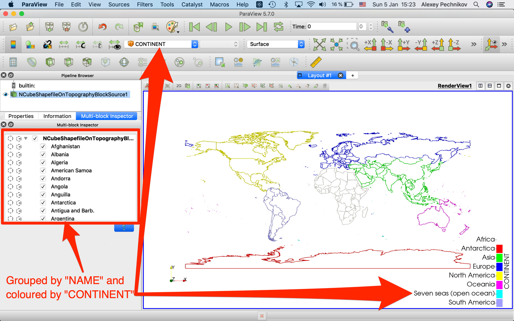
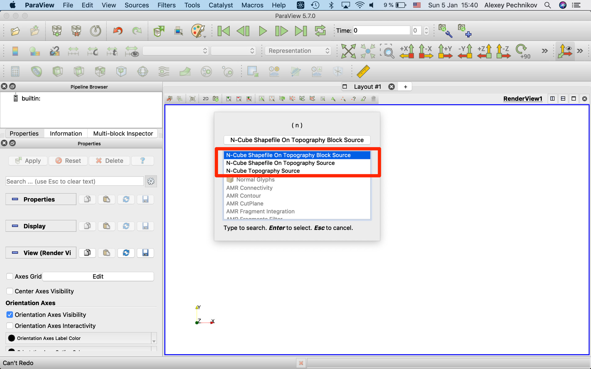
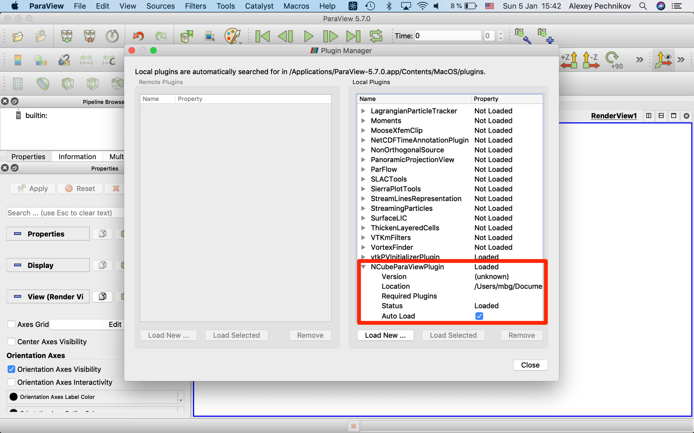

# ParaView-plugins

## About the project

[N-Cube ParaView plugin](NCube/NCubeParaViewPlugin.py) is [MIT-licensed](LICENSE) set of ParaView data sources to load well-known QGIS datasets like to shapefiles, GeoTIFF rasters, etc. It's compact and extensible through the published version is focused on just some most popular data formats and conversion types. 

## How to Use

Recent ParaView release 5.7 for MacOS integrated with Python 2.7 and so we need to use Python 2.7 installation and modules on MacOS. On Windows and Linux operation systems we can select between Python 2.7 and 3.7. Anyway, use the same Python as your ParaView build requires.

Follow instructions to install Python 2.7 and configure PYTHONPATH environment variable as this article describing: https://www.linkedin.com/pulse/paraview-pvgeo-plugins-howto-alexey-pechnikov/

Install required Python 2.7 modules:
```
pip2.7 install numpy xarray pandas geopandas shapely vtk rtree
```

Load [N-Cube ParaView plugin Python source file](NCube/NCubeParaViewPlugin.py) placed anywhere on your computer.

## Project Goals

For our 3D geological modeling we need a good 3D visualization and data processing tools. We tested many commercial and Open Source 3D visualization packages and programming libraries and for our needs Open Source ParaView software and it's core VTK library are the best one. [ParaView](https://www.paraview.org/) is the great 3D visualization and processing tool but without GIS data support. To fix the lack, we created ParaView geospatial plugins for our internal usage.

See also our code snippets repository [ParaView Programmable Source and Programmable Filter examples](https://github.com/mobigroup/gis-snippets/tree/master/ParaView) and [A brief explanation of the 3D Density-Depth model construction](https://www.linkedin.com/pulse/brief-explanation-3d-density-depth-model-construction-pechnikov/).

## Screenshots











## Used Technologies

We prefer stable and modern programming libraries and technologies:

[VTK: The Visualization Toolkit](https://vtk.org/)

[Xarray: N-D labeled arrays and datasets in Python](http://xarray.pydata.org/en/stable/)

[Rasterio: Python access to geospatial raster data](https://rasterio.readthedocs.io/en/latest/)

[GeoPandas: Python geospatial operations on geometric types](http://geopandas.org/)

[Pandas: Python Data Analysis Library](https://pandas.pydata.org/)

[Shapely: Python package for manipulation and analysis of planar geometric objects](https://shapely.readthedocs.io/en/latest/project.html)

[GEOS: Geometry Engine, Open Source](https://trac.osgeo.org/geos/)

[PROJ: generic coordinate transformation software](https://proj.org/)

## Authors

Alexey Pechnikov

https://orcid.org/0000-0001-9626-8615 (ORCID)

E-mail: pechnikov@mobigroup.ru
