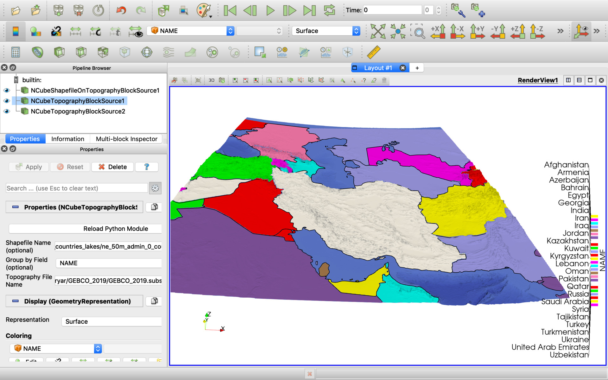

# N-Cube ParaView plugin for 3D/4D GIS Data Visualization

## About the project

[N-Cube ParaView plugin](NCube/NCubeParaViewPlugin.py) is [MIT-licensed](LICENSE) set of ParaView data readers/sources/filters/writers to load, process, and write well-known GIS datasets like to shapefiles, GeoTIFF rasters, etc. It's compact and extensible through the published version is focused on just some most popular data formats and conversion types. 

This plugin is tested on MacOS only because we still work on the functionality. We will test it completely on Linux and Windows for ParaView 5.8 release (waiting in 1-2 months). For now, you can try the plugin on Linux and Windows in ParaView 5.7 with Python 2.7.

## How to Use

Recent ParaView release 5.7 for MacOS integrated with Python 2.7 and so we need to use Python 2.7 installation and modules on MacOS. On Windows and Linux operation systems we can select between Python 2.7 and 3.7. Anyway, use the same Python as your ParaView build requires.

Follow instructions to install Python 2.7 and configure PYTHONPATH environment variable as this article describing: https://www.linkedin.com/pulse/paraview-pvgeo-plugins-howto-alexey-pechnikov/

Install required Python 2.7 modules:
```
pip2.7 install numpy xarray pandas geopandas shapely vtk rasterio lasio
```

Load [N-Cube ParaView plugin Python source file](NCube/NCubeParaViewPlugin.py) placed anywhere on your computer.

### N-Cube ParaView Plugin Readers:

**N-Cube LAS Well Log Reader** - Read Well Log versions 1.2 and 2.0 of the LAS file specification.

### N-Cube ParaView Plugin Writers:

**ESRI Shapefile** - Use ParaView menu Save -> Save Data -> ESRI Shapefile(\*.shp) to save geometry as ESRI Shapefile (Point). By performance reasons in case when the geometry includes more than 1M points only bounding box will be saved.

### N-Cube ParaView Plugin Sources:

**N-Cube Shapefile On Topography Block Source** - data source for 2D/3D Shapefile or GeoJSON. Optionally GeoTIFF or NetCDF topography (DEM) raster using to define Z coordinates. Optional "Group by Field" parameter produces a set of layers from geometries grouped by the field. When the "Group by Field" parameter is not defined ("None") all the geometries separated as the layers. All shapefile fields presented in the ouput.

**N-Cube Topography Block Source** - data source for GeoTIFF or NetCDF topography (DEM) raster visualization as 3D surface. Only "Group by Field" parameter presented in the ouput.

Geometry coordinate system re-projecting to raster coordinate system and the geometry cropping to the raster extent when the topography file using and the both coordinate systems are defined.

## Project Goals

For our 3D geological modeling we need a good 3D visualization and data processing tools. We tested many commercial and Open Source 3D visualization packages and programming libraries and for our needs Open Source ParaView software and it's core VTK library are the best one. [ParaView](https://www.paraview.org/) is the great 3D visualization and processing tool but without GIS data support. To fix the lack, we created ParaView geospatial plugins for our internal usage.

See also our code snippets repository [ParaView Programmable Source and Programmable Filter examples](https://github.com/mobigroup/gis-snippets/tree/master/ParaView) and [A brief explanation of the 3D Density-Depth model construction](https://www.linkedin.com/pulse/brief-explanation-3d-density-depth-model-construction-pechnikov/).

## Screenshots




## Used Technologies

We use this set of programming libraries and technologies:

[VTK: The Visualization Toolkit](https://vtk.org/)

[Xarray: N-D labeled arrays and datasets in Python](http://xarray.pydata.org/en/stable/)

[Rasterio: Python access to geospatial raster data](https://rasterio.readthedocs.io/en/latest/)

[GeoPandas: Python geospatial operations on geometric types](http://geopandas.org/)

[Pandas: Python Data Analysis Library](https://pandas.pydata.org/)

[Shapely: Python package for manipulation and analysis of planar geometric objects](https://shapely.readthedocs.io/en/latest/project.html)

[GEOS: Geometry Engine, Open Source](https://trac.osgeo.org/geos/)

[PROJ: generic coordinate transformation software](https://proj.org/)

[Log ASCII Standard (LAS) files in Python](https://lasio.readthedocs.io/en/latest/)

## Authors

Alexey Pechnikov

https://orcid.org/0000-0001-9626-8615 (ORCID)

E-mail: pechnikov@mobigroup.ru
